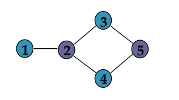
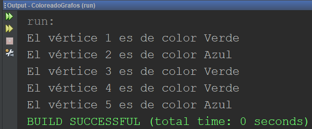

# ColoreadoGrafos

## Problema del coloreado de un grafo
– Sea G=(V,A) un grafo no dirigido cuyos vértices se desea colorear. 

– Se exige que todo par de vértices unidos por una arista tengan asignados colores diferentes.

– Se pretende emplear el menor número posible de colores.

## Algoritmo voraz de coloreado de un grafo:
• escoger inicialmente un color y un vértice arbitrario como punto de partida; 

• tratar de asignarle ese color al mayor número posible de vértices, respetando la restricción impuesta (vértices adyacentes deben tener distinto color); 

• escoger otro vértice aún no coloreado y un color distinto y repetir el proceso hasta haber coloreado todos los vértices.

 

## Solución
Utilización del método de grado interno de un grafo, el cual consiste en contar los arcos que apuntan a un vértice, se modificó para que reciba un color y verifique si un arco adyacente ya posee o no ese color.

**Método de grado interno:**
```
public int gradoInterno(vertice destino) { 
        int cont = 0;
        vertice aux = grafo;
        while (aux != null) {
            if (aux != destino) {
                if (buscar(aux, destino) != null) {
                    cont++;
                }
            }
            aux = aux.sigV;
        }
        return cont;
    }
```
**Método de grado interno modificado:**
```
public boolean gradoInternoModificado(vertice destino, String color) { 
        vertice aux = grafo;
        while (aux != null) {
            if (aux != destino) {
                if (buscar(aux, destino) != null) {
                    if (aux.color.equals(color)) {
                        return false;
                    }
                }
            }
            aux = aux.sigV;
        }
        return true;
    }
```

La salida sería la siguiente:

 

## Integrante:
* Sebastián Rojas Vargas [LinkedIn](https://www.linkedin.com/in/sebastian-rojas-vargas/), [GitHub](https://github.com/SebastianRV26)

Curso: Análisis de algoritmos.
I Semestre 2020.
Profesora: Lorena Valerio.